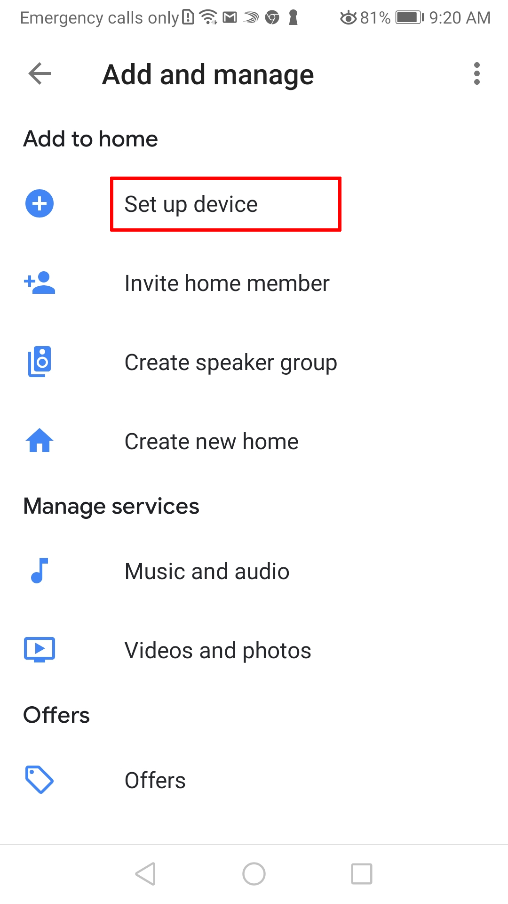
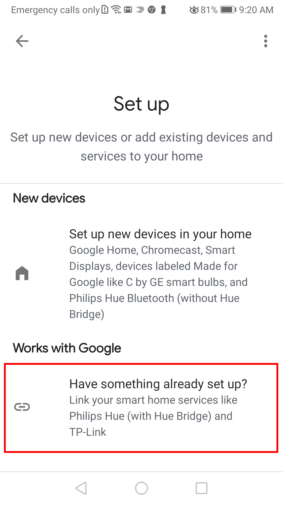
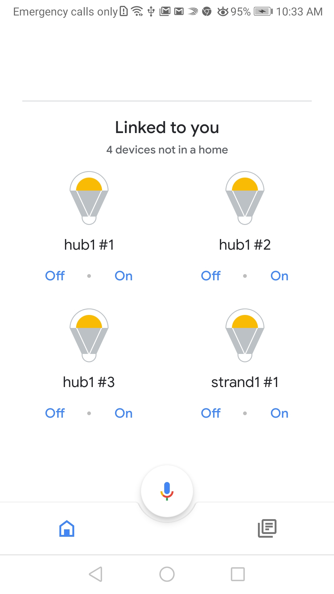

# Google Home Local Execution : HTTPS error -> Failed to fetch
Writen date: 2020-03-05 10:31:23 Thursday.
Author: Rajaona Jean.

**The goal here is to let you reproduce https error I encountered.** 

>[Local execution implementation documention from google.](https://developers.google.com/assistant/smarthome/concepts/local)
>
> Base code (git repository): 
>  - [Light Simulation](https://github.com/actions-on-google/smart-home-local)
>  	I used this code to illustrate my problem.

**Table of content**
1. [Prerequistes](#prerequistes)
2. [Get started](#get-started)
	- 2.1 [Create your project](#create-project)
	- 2.2 [Configure your Google Home App with your virtual devices](#config-google-home)
		 + 2.2.1 [Deploy cloud function firebase to synchronize your virtual devices with your google home app](#sync)
		 + 2.2.2 [Install Google Home App](#google-home-app)
	- 2.3 [Run the code locally](#run-locally)
		 + 2.3.1 [Run virtual hub and device](#run-hub)
		 + 2.3.2 [Run the app which will handle smart speaker request](#run-app)
		 + 2.3.3 [Make it run on your google home device](#on-gg_home)
3. [Debug Code to see Https error](#debug) 
		 


<a name="prerequistes"></a>

# 1. Prerequistes

Be familiar with main concept of local execution.
> More details here: https://developers.google.com/assistant/smarthome/concepts/local

######  My Environment
|              |    Version     |
| --------------------- | :------------: |
| Google home nest mini | 2nd generation |
| Windows               |       10       |
| Ngrok                 |     2.2.8      |
| Node                  |    12.15.0     |
| Firebase              |       ''       |
| Google Home app       |       ''       |
| Chrome                | 80.0.3987.132 (Build officiel) (64 bits) |  

> I use an Android as Operating system on my phone but it should work the same way with IOS.

<a name="get-started"></a>

# 2. Get started
Get the code, run command: `git clone https://github.com/killvi/localExecutionHttpsError.git`

<a name="create-project"></a>

## 2.1 Create your project
 1. Go on this url: https://console.actions.google.com/ and connect yourself with a google account.

 2. Click on **New Project**:

 	

 3. Now be aware of your project Id:

	

	

 4. Now give a name that will be seen in google home app when you will add this environment:

  	

<a name="config-google-home"></a>

## 2.2 Configure your Google Home App with your virtual devices

<a name="sync"></a>

### 2.2.1 Deploy cloud function firebase to synchronize your virtual devices with your google home app

<a name="google-home-app"></a>

Go in *syncHandlerFirebase*  folder and run these commands on a terminal:

 1. `npm install`

 2. `npm run firebase use ${your-project-id}`

	You Should see something like that:

	```shell
	PS C: /path/localExecutionhttpsError/syncHandlerFirebase> npm run firebase use ${your-project-id}  

	> smarthome-provider-placeholder@0.0.1 firebase C:/path/localExecution/https/syncHandlerFirebase
	> firebase "use" "your-project-id"

	Now using project ${your-project-id}
	```
 3. `npm run initHub`

	You Should see this:
	```shell
	PS C: /path/localExecutionhttpsError/syncHandlerFirebase> npm run initHub

	> smarthome-provider-placeholder@0.0.1 initHub C: /path/localExecutionhttpsError/syncHandlerFirebase
	> firebase functions:config:set hub1.leds=16 hub1.channel=1,2,3

	+  Functions config updated.

	Please deploy your functions for the change to take effect by running firebase deploy --only functions
	```
 4. `npm run deploy`
 
 ***
 
Now you will need to configure Google Action Console, but first, some firebase information are needed:

 1. Go there: https://firebase.google.com/

 2. Click on **Go to console**:

 

 3. Click on your project:

 

 4. Click on **functions** and get these 3 urls:

 

<table>
	<tr>
		<td>Smarthome</td>
		<td>
			https://${region}-${your-project-id}.cloudfunctions.net/smarthome
		</td>
	</tr>
	<tr>
		<td>Authorize</td> 
		<td>
			https://${region}-${your-project-id}.cloudfunctions.net/authorize
		</td>
	</tr>
	<tr>
		<td> token </td> 
		<td>
			https://${region}-${your-project-id}.cloudfunctions.net/token
		</td>
	</tr>
</table>	
	
***
 
 1. Now go here: https://console.actions.google.com/
 
 2. Put *smarthome* url here and **save** your changes:
 
  
  
 3. Put *authorization* and *token* urls here and **save** your changes:
 
  

> Note: The Client Id and the Client Secret are not importante here. Personnaly I put my project Id as Cloud Client Id and a random letter as Client Secret. 

### 2.2.2 Install Google Home App
1. Go on Google Play or Apple store and dowload Google Home.


2. Configure your Google Home mini to work with your app.

3. Now add your devices environment on your google home app. Open it and, follow these steps:

  |  | 

Search *the project* you created and add it.

 |  | 

Now you should see your virtual devices



<a name="run-locally"></a>

#### 2.2 Run the code locally

<a name="run-hub"></a>

##### 2.2.1 Run virtual hub and devices

Go in *deviceDiscoverable*  folder and run command:
1. `npm install`

2. `npm start`

In terminal, you should see this:
```shell
PS C: /path/localExecutionhttpsError/deviceDiscoverable> npm start

> fakecandy@0.0.1 start C: /path/localExecutionhttpsError/deviceDiscoverable
> ts-node server.ts --device_id hub1 --udp_discovery_port 3311 --udp_discovery_packet A5A5A5A5 --channel 1 --channel 2 --channel 3

discovery listening { address: '0.0.0.0', family: 'IPv4', port: 3311 }
opc listening { address: '::', family: 'IPv6', port: 7890 }
```

<a name="run-app"></a>

### 2.2.2 Run the app which will handle requests

Go in *app*  folder and run command:
1. `npm install`

2. `npm start`

3. `ngrok http 8080 -host-header="localhost:8080"`

4. Get your Ngrok gateway:

	

5. Now Go here: https://console.actions.google.com/

6. Put Ngrok gateway url here and save change:

	

<a name="on-gg-home"></a>

### 2.2.3 Make it run on your google home device

1. You need to configure the scan method of your google home device. To do so go here:
https://console.actions.google.com/

2. Put following information in *Add device scan configuration*: 

<table>
	<tr>
		<td>UDP discovery port in</td>
		<td>
			3312
		</td>
	</tr>
	<tr>
		<td>UDP discovery port out</td> 
		<td>
			3311
		</td>
	</tr>
	<tr>
		<td>UDP discovery address</td> 
		<td>
			255.255.255.255
		</td>
	</tr>
	<tr>
		<td>UDP discovery packet</td> 
		<td>
			A5A5A5A5
		</td>
	</tr>
</table>	


3. Now just restart your google home and you will see that with ngrok:


<a name="debug"></a>

# Debug Code to see Https error

Here if everything went well, following steps should be checked:
- [x] Virtual devices are synchronized with your google home app.
- [x] Your google home device is on.
- [x] Your code is runnig on your google home device. 

Now to see what happen in your google home, go here: [chrome://inspect/#devices](chrome://inspect/#devices), and wait a few moment.

1. You should see your google home device and just below you can see its name: 


2. Now click on *inspect*:


3. It will open a web view, as followed: 


4. Here you can see errors i encounter:


I have cors error and a failed to fecth error when i try to send a request to google but google respond with a 200 status code. 
